# Agrega seguridad a tu aplicación de IA Gen con Azure Key Vault

## Objetivo de la práctica:
Al finalizar la práctica, serás capaz de:
- Al finalizar la práctica, serás capaz de:
- **Configurar** claves de autenticación para acceder a servicios de Azure AI.
- **Implementar** el almacenamiento seguro de claves utilizando Azure Key Vault.
- **Integrar** una aplicación con Azure AI Services mediante identidades y acceso seguro a secretos.


## Objetivo Visual 

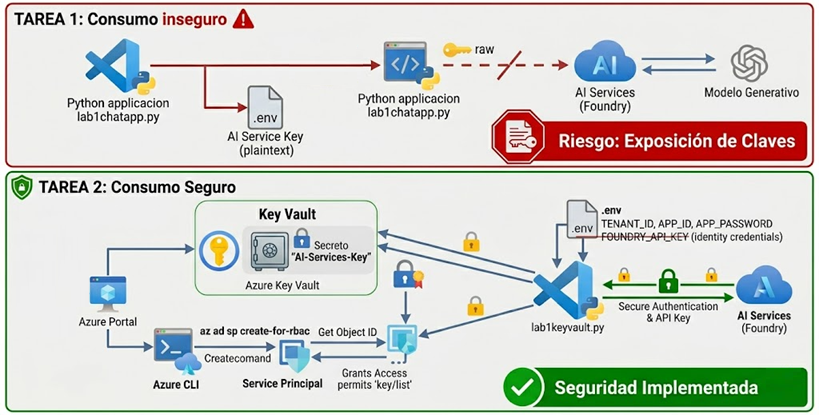

## Duración aproximada:
- 30 minutos.

## Credenciales para ingresar a Azure:

Consúltalas con tu instructor.

## Instrucciones 

El uso de Azure Key Vault e identidades administradas es fundamental para garantizar la seguridad en el consumo de modelos generativos, ya que permite proteger credenciales sensibles y evitar su exposición en el código o configuraciones inseguras. Al centralizar el almacenamiento de secretos en Key Vault y utilizar identidades administradas para autenticar aplicaciones sin necesidad de manejar contraseñas, se reduce significativamente el riesgo de accesos no autorizados y filtraciones de información. Este enfoque no solo fortalece la postura de seguridad de las soluciones de inteligencia artificial, sino que también facilita la gestión de accesos y el cumplimiento de buenas prácticas en entornos empresariales.


### Tarea 1. Consumir un modelo generativo sin seguridad.

Paso 1.	Abre Visual Studio Code

Paso 2.	Haz clic en la opción **File** del costado superior izquierdo y luego **Open Folder...**.

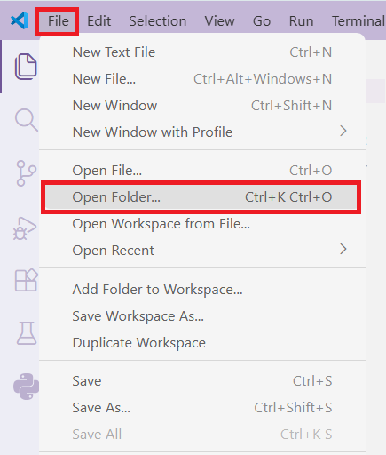
 
Paso 3.	Busca en **Documentos** una carpeta llamada **Lab1KeyVault** y haz clic en el botón **Select folder**.

Paso 4.	Abre el archivo ```lab1chatapp.py``` y échale un vistazo. Es un pequeño script en Python que consume un modelo generativo desde Foundry. 

Este no es un curso de desarrollo, por lo cual, lo que nos interesa por el momento es la línea 19, fíjate que la API Key se consume desde un archivo plano en el mismo directorio llamado **.env**.

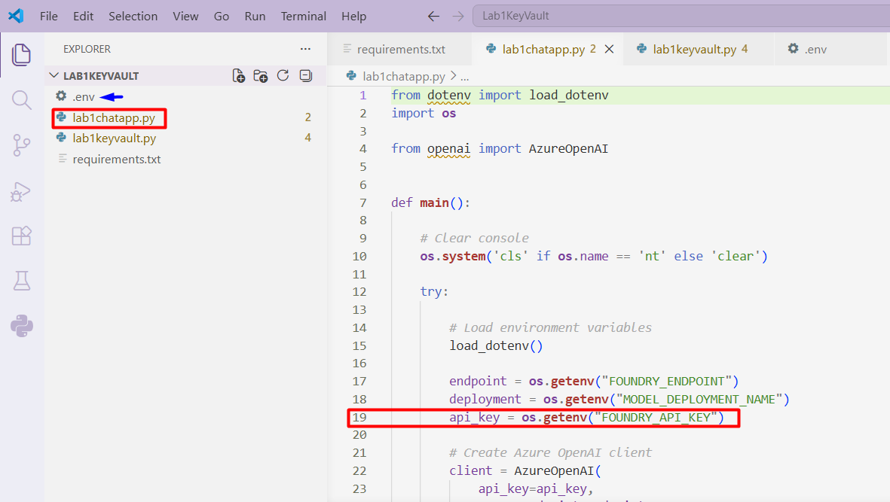

Paso 5.	Abre el navegador y en una nueva pestaña accede a ```https://ai.azure.com/```. Inicia sesión usando las credenciales proporcionadas por el instructor.

Paso 6. Ya tendrás un proyecto creado, en ocasiones al iniciar sesión ya estarás dentro, de lo contrario, accede en el nombre del proyecto llamado ```cybersec_curso```.

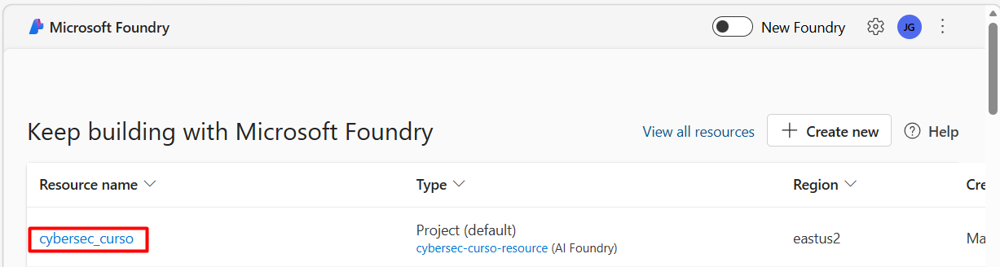


Paso 7.	Copia el valor del **API Key** y **Azure OpenAI endpoint**.

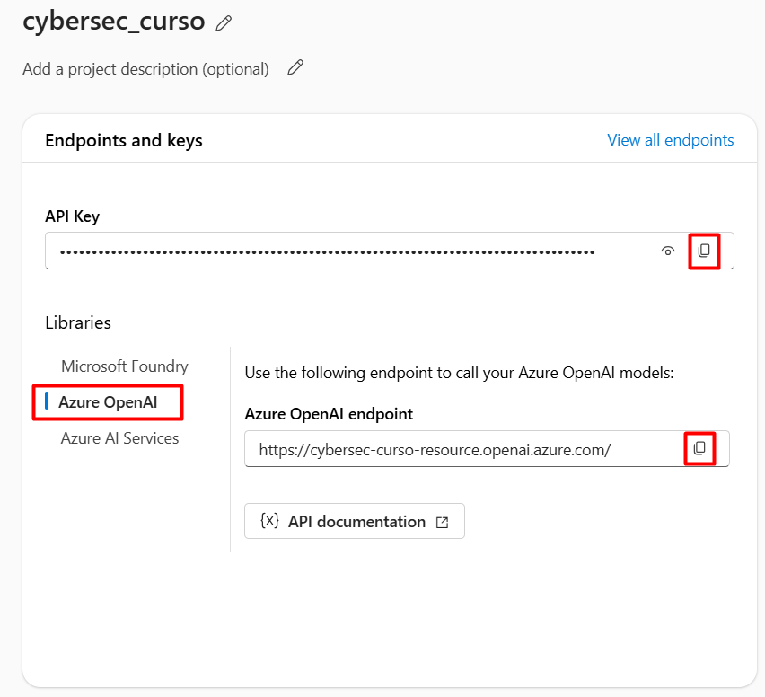

Paso 8. Regresa a Visual Studio Code y abre el archivo **.env**. Reemplaza los siguientes valores:
- **your_foundry_key** por el valor **API Key** que copiaste en el paso anterior. 
- **your_foundry_endpoint** por el valor **Azure OpenAI endpoint** que copiaste en el paso anterior. 

Paso 9. Abre una terminal integrada en Visual Studio Code con la siguiente combinación de teclas **Ctrl+ñ**.

Paso 10. En la terminal ejecuta el siguiente comando:

```powershell
pip install -r requirements.txt
```

Paso 11.	Espera que termine de instalar las dependencias el comando del paso anterior. Luego, ejecuta el siguiente comando para lanzar la aplicación:

```powershell
python lab1chatapp.py
```

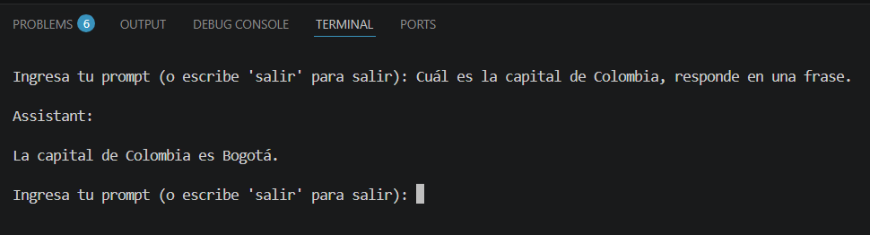

### Tarea 2. Consumir un modelo generativo de forma segura con Azure Key Vault

Paso 1.	Regresa al navegador, abre una nueva pestaña y accede a ```https://portal.azure.com/```. De ser necesario, usa nuevamente las credenciales proporcionadas por tu instructor. 

Paso 2. Una vez dentro de Azure, ingresa ```Key Vaults``` en la barra de búsqueda de la parte superior. 

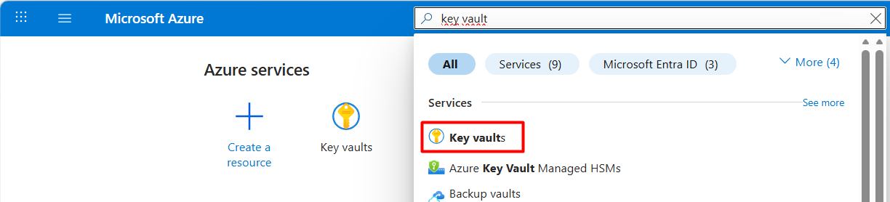

Paso 3. El laboratorio previamente creó un recurso de Azure Key Vaults para ti llamado **cybersec-class-key**, ábrelo. 

Paso 4. En el menú del costado izquierdo abre **Access policies**. Luego haz clic en **+ Create**.

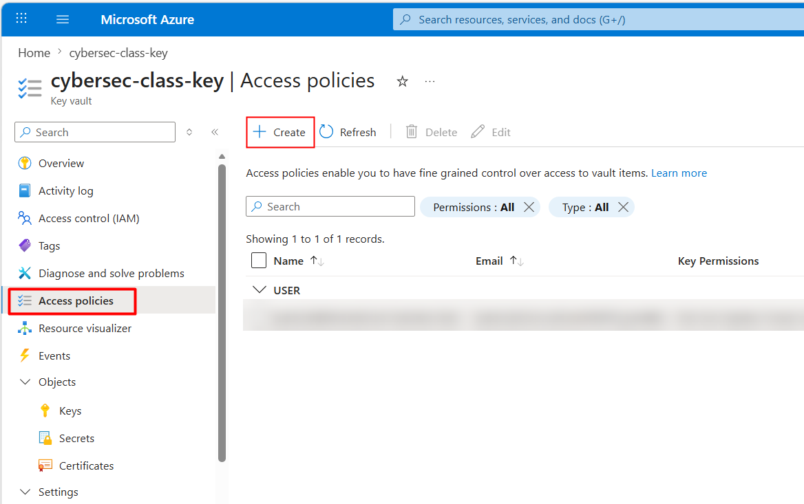

Paso 5. Selecciona el template **Key, Secret, & Certificate Manager** y haz clic en **Next**

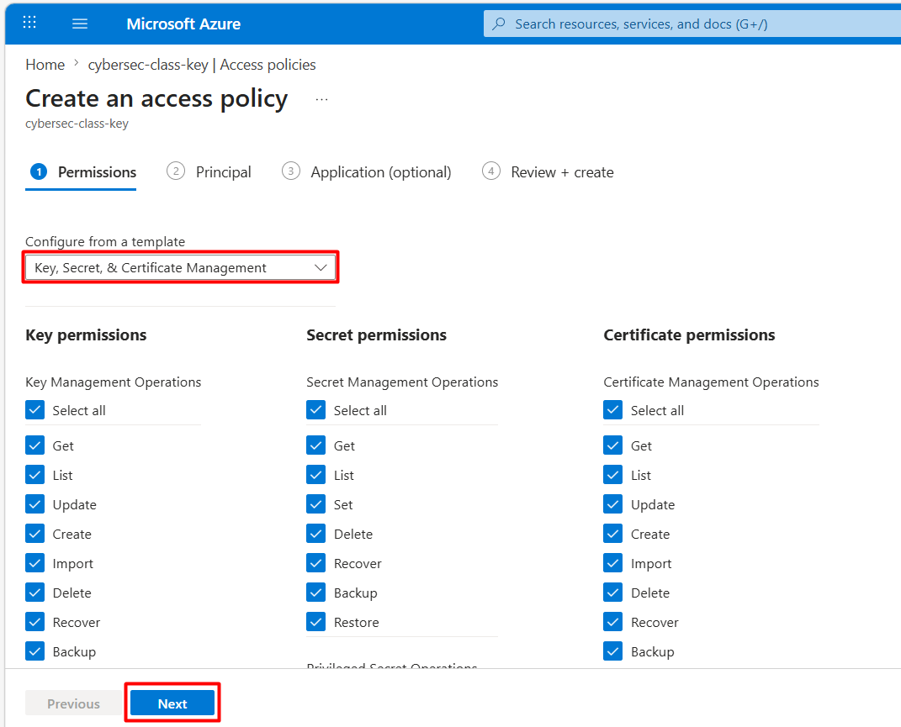

Paso 6. Busca y selecciona tu usuario y haz clic en **Next**.

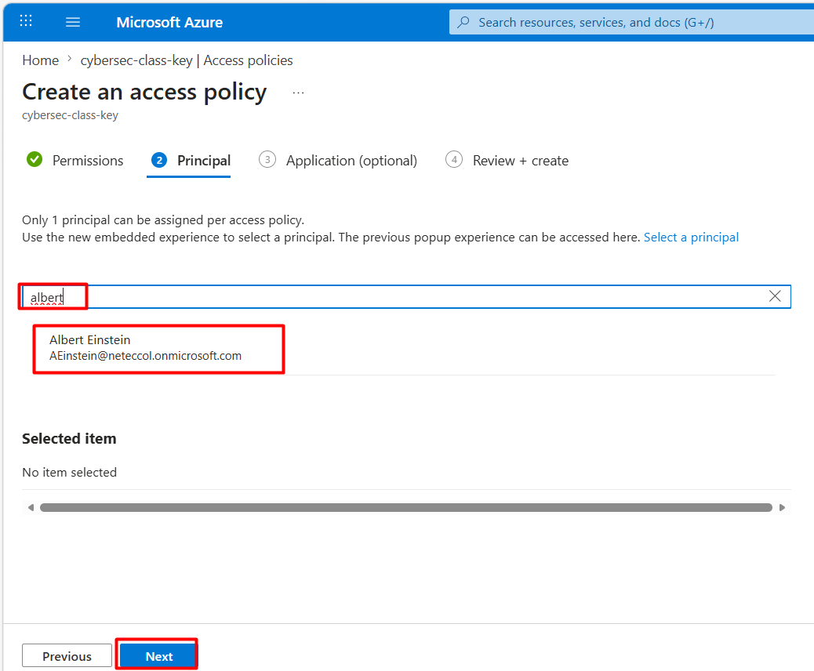

Paso 7. Haz nuevamente clic en **Next** y finalmente **Create**.

Paso 8. Ahora haz clic en la opción **Secrets** del menú izquierdo y luego en **+ Generate/Import**.

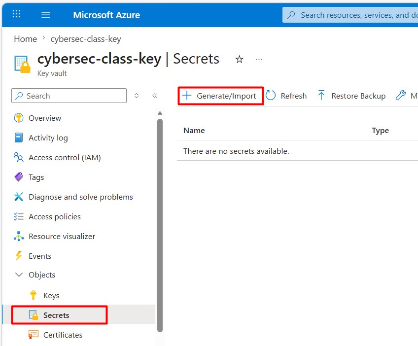

Paso 9. Configura los siguientes parámetros y haz clic en **Create**.

- **Upload options**: Manual
- **Name**: ```AI-Services-Key``` (es importante que el nombre coincida exactamente, porque más adelante ejecutarás código que recupera el secreto basado en ese nombre)
- **Value**: Pega el valor del API Key que copiaste en la tarea anterior.

Paso 10. Para acceder al secreto en Key Vaults, tu aplicación debe usar un Service Principal que tenga acceso al secreto. Usarás Azure CLI para crearlo, encontrar su ID de objeto y conceder acceso al secreto en Azure Vault.

En el costado superior derecho haz clic en el Cloudshell (El ícono al costado de Copilot). De ser necesario configúralo sin Storage Account.


Paso 11. Ejecuta el siguiente comando para crear un Service Principal y asignarle el rol de propietario (**owner**) en el grupo de recursos donde están desplegados tus servicios de IA de Azure y Azure Key Vaults. Asegúrate de modificar el comando con los valores correctos.
Reemplaza **<spName>** por un nombre único adecuado para la identidad de una aplicación (por ejemplo, ai-app con tus iniciales añadidas al final; el nombre debe ser único dentro de tu tenant). También reemplaza **<subscriptionId>** y **<resourceGroup>** por los valores correctos para tu ID de suscripción y el grupo de recursos que contiene tus servicios de IA de Azure y Azure Key Vaults. Estos están en la sección Overview de tu Azure Key Vaults. 

```powershell
az ad sp create-for-rbac -n "api://<spName>" --role owner --scopes subscriptions/<subscriptionId>/resourceGroups/<resourceGroup>
```
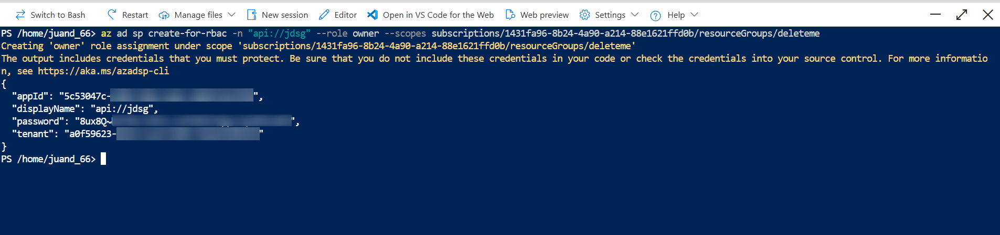

Paso 12. Asegúrate de guardar en un bloc de notas los datos devueltos por el comando del paso anterior; los necesitarás más adelante 

>📌 **Nota**: Si cierras este terminal, no podrás recuperar la contraseña; así que es importante anotar los valores ahora.

Paso 13. Para obtener el ID de objeto de tu service principal, ejecuta el siguiente comando CLI de Azure, reemplazando **<appId>** por el valor del App ID que obtuviste del paso anterior.

```powershell
az ad sp show --id <appId>
``` 

Paso 14. Copia el valor "id" del json devuelto por el comando anterior. 

Paso 15. Para asignar permisos a tu nuevo service principal para acceder a los secretos de tu Key Vault, ejecuta el siguiente comando, reemplazando el <objectId> por el valor del ID de tu service principal que acabas de copiar.

```powershell
az keyvault set-policy -n cybersec-class-key --object-id <objectId> --secret-permissions get list
```

Paso 16. Regresa a Visual Studio Code. Abre el archivo **.env** y termina de actualizarlo con los siguientes datos:

- **TENANT_ID=** El ID del tenant. Lo guardaste en el paso 12.
- **APP_ID=** El ID de la App. Lo guardaste en el paso 12. 
- **APP_PASSWORD=** La contraseña del service principal. Lo guardaste en el paso 12.
- **FOUNDRY_API_KEY=** ELIMÍNA LA CLAVE, YA NO LA NECESITAS, EL VALOR ESTÁ EN KEY VAULTS. 

Guarda los cambios.

Paso 17. En la terminal ejecuta el siguiente comando para probar tu aplicación segura. 

```powershell
python .\lab1keyvault.py
```

Paso 18. Ingresa un prompt de prueba. 

### Resultado esperado

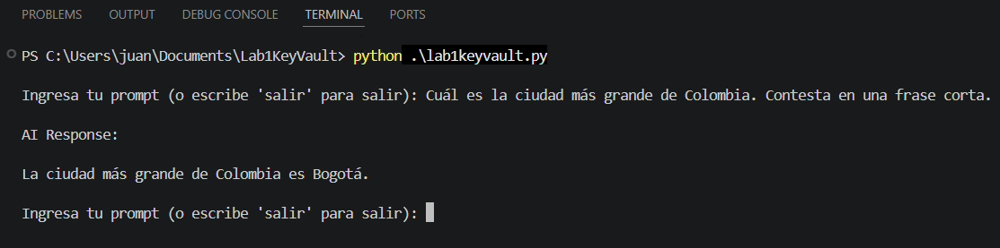

> Regresa al navegador con el portal de Azure, en el menú del costado izquierdo del recurso ```cybersec-class-key``` selecciona **Metrics** y elige la métrica **Total Service Api Hits**. Comprueba que se haya ejecutado. 

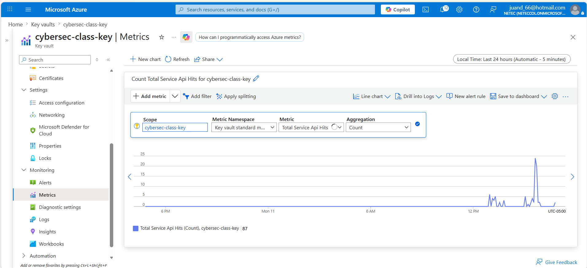