# Crea un flujo en LangSmith para analizar registros de seguridad

## Objetivo de la práctica:
Al finalizar la práctica, serás capaz de:

- **Utilizar** LangChain para cargar y dividir archivos de log en fragmentos procesables.
- **Aplicar** cadenas de procesamiento en LangChain para agrupar eventos por IPs frecuentes y detectar repeticiones.
- **Generar** un reporte automatizado con LangChain que resuma patrones y anomalías en los registros.

## Prerrequisitos

- Haber completado el Laboratorio 1.

## Objetivo Visual 

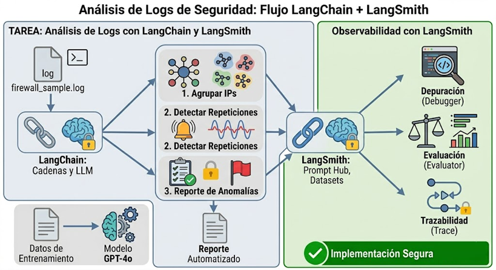

## Duración aproximada:
- 20 minutos.

## Credenciales para usar LangSmith

Las mismas credenciales del laboratorio 1.

## Instrucciones 

LangChain y LangSmith están estrechamente relacionados: LangChain provee el marco para construir flujos de procesamiento de datos con modelos de lenguaje, mientras que LangSmith ofrece herramientas de observabilidad, depuración y evaluación de esos flujos. En ciberseguridad, esta combinación resulta muy útil porque permite diseñar pipelines que analicen grandes volúmenes de logs, dividan la información en fragmentos manejables, apliquen cadenas de análisis y generen reportes automatizados. LangSmith, por su parte, asegura que esos flujos funcionen de manera confiable, midiendo su desempeño y detectando errores o sesgos. Así, juntos permiten implementar soluciones que no solo identifican patrones de actividad y anomalías en registros de red, sino que también garantizan que el proceso de detección y clasificación sea transparente, auditable y escalable para equipos de seguridad.

### Crear la cuenta de LangSmith
Paso 1. Abre el navegador e ingresa a la siguiente URL: ```https://smith.langchain.com/```. Registrate usando las mismas credenciales que has usado hasta el momento. 

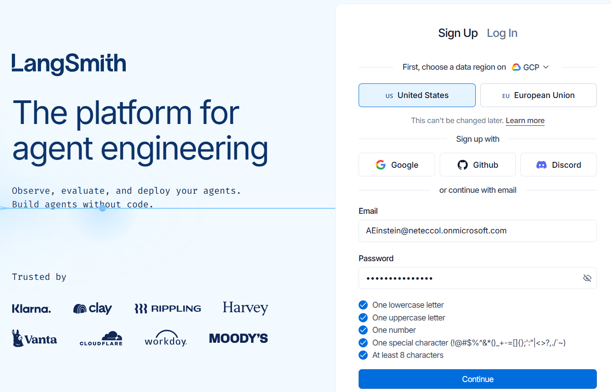

Paso 2.	Desde otra pestaña en el navegador ingresa a: ```https://outlook.office.com/```, inicia sesión con la misma cuenta, busca el correo de **LangChain** y confirma tu dirección.

Paso 3. En la nueva pestaña que se abre haz clic en **Confirm account**. Luego, **Non-Technical** y en **Fleet** haz clic en **Get Start**.

Paso 4. En la ventana emergente haz clic en **Skip setup**.

Paso 5. Ya deberías tener acceso al portal. En el costado superior izquierdo cambia **Fleet** por **LangSmith**.

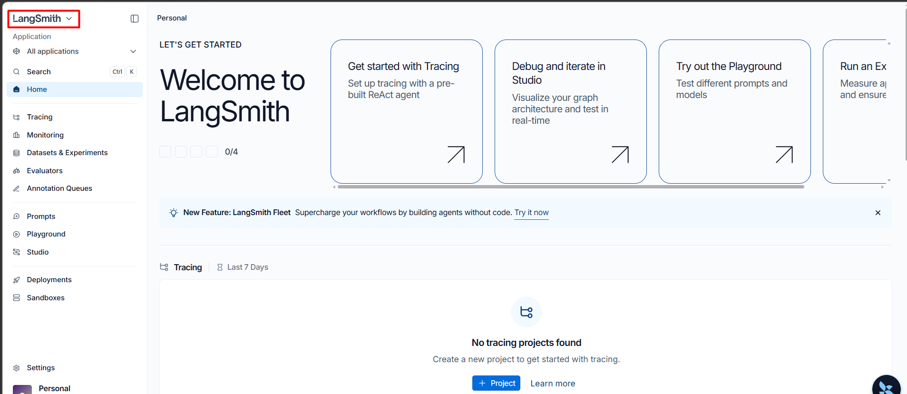

Paso 6. En el menú del costado izquierdo selecciona **Datasets & Experiments**, agrega ```Security Logs``` como el nombre del dataset y luego haz clic en el botón azul **Create a dataset**.

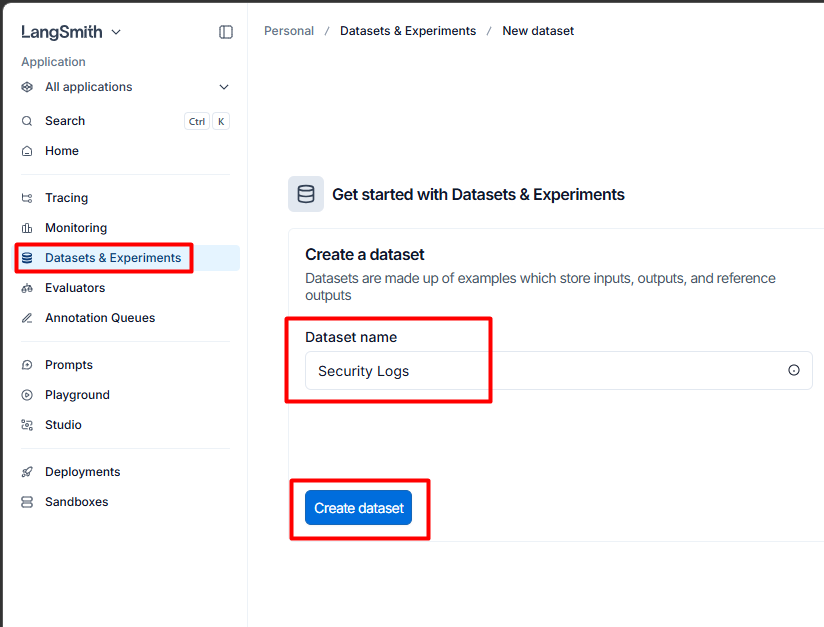

Paso 7. El nuevo dataset se abrirá en la pestaña Examples. Esta capacidad será la que usemos en este laboratorio. Haz clic en el botón azul de la derecha **+ Example** y despupés en **+ Add Example**.

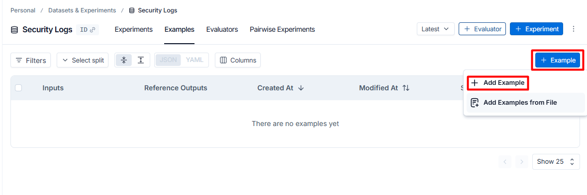

>📌 **Nota**:
> - **Experiments** 🔬: Para crear y gestionar experimentos que evalúan el rendimiento de tus modelos con diferentes configuraciones.
> 
> - **Examples** 📑: Donde se almacenan y revisan los ejemplos (inputs y outputs) que sirven como casos de prueba para tu dataset.
> 
> - **Evaluators** 🧮: Configuras evaluadores (métricas, funciones de scoring) que medirán la calidad de las respuestas de tu modelo.
> 
> - **Pairwise Experiments** ⚖️: Comparas dos modelos o dos versiones de un mismo modelo lado a lado para ver cuál responde mejor.

Paso 8. En la sección **Inputs** agrega el siguiente JSON:

```json
{
  "logs": ""
}
```

Paso 9. Haz clic en **Submit**.

Paso 10. Sobre el nuevo ejemplo creado haz clic en los tres puntos verticales del costado derecho y selecciona **Edit**.

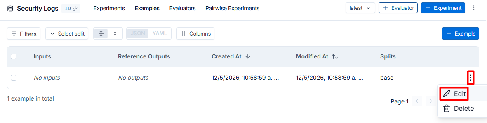

Paso 11. En la sección Inputs, debajo de **T "Logs"** agrega el contenido del archivo **firewall_sample** que se encuentra en el escritorio de tu máquina. Luego haz clic en el botón **Submit**.

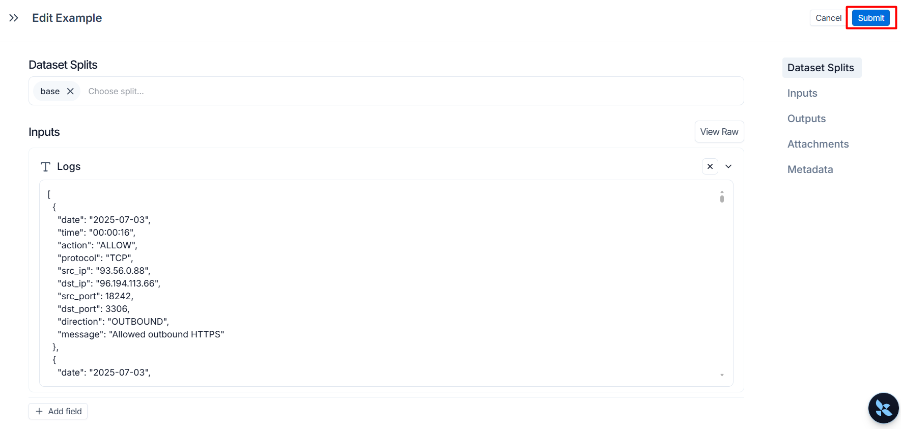

>📌 **Nota**:
>```https://smith.langchain.com/hub```
>LangChain Hub es un repositorio en línea, integrado dentro de la plataforma LangSmith, que funciona como una “biblioteca compartida” donde la comunidad puede publicar, versionar, explorar y reutilizar artefactos clave para construir aplicaciones con LLMs —principalmente prompts, pero también chains y agentes completos—; su objetivo es agilizar el intercambio de buenas prácticas, inspirar nuevos casos de uso y ofrecer un lugar centralizado para descubrir componentes listos para producción que se pueden clonar o probar directamente desde la interfaz web o mediante el SDK.

Paso 12. En el menú del costado izquierdo busca y seleccional **Playground**.

Paso 13. Configura el **Playground** de la siguiente manera:

- **System** reemplaza "You are a chatbot." por: ```Eres un asistente de análisis de Ciberseguridad```.
- **Human** reemplaza "{question}" por:

```text
Analiza el siguiente registro de eventos de red. Identifica:
1. IPs más frecuentes (origen y destino)
2. Eventos repetidos
3. Comportamientos anómalos
4. Recomendaciones técnicas

LOG:
{logs}
```

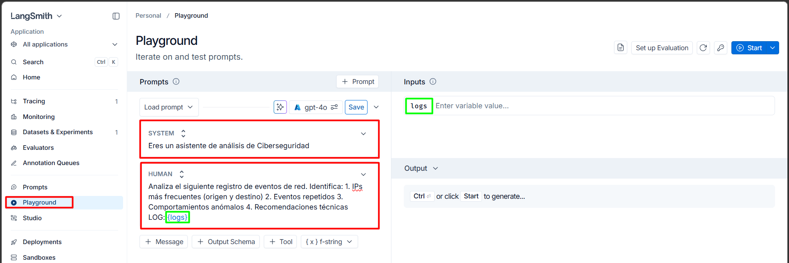

Paso 14. En la parte central hay un botón que dice Save y al costado derecho un modelo seleccionado, haz clic sobre dicho modelo. 

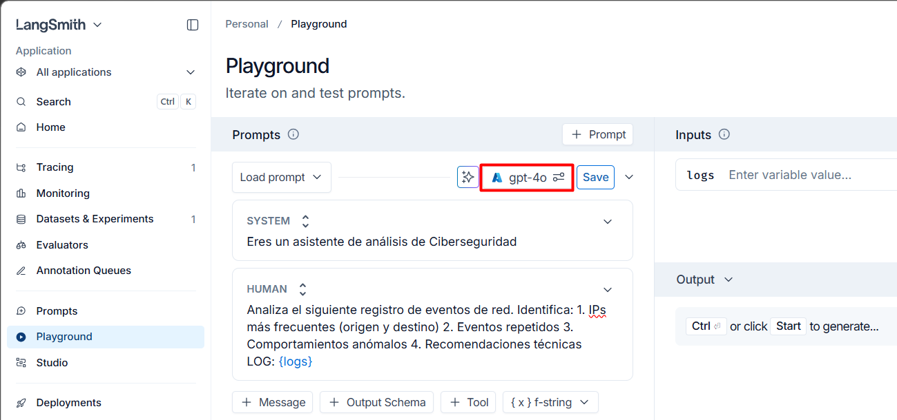

Paso 15. En la ventana emergente configura los siguientes datos:
- **Provider**: Azure OpenAI
- **Deployment Name**: GPT-4o
- **Azure Endpoint**: [Regresa a Foundry, haz clic en la sección **Models + endpoints** y abre el nombre del deployment: gpt-4o]
- **API Version**: 2025-02-01-preview
- **IMPORTANTE** ➡️ **Provider API**: Chat Completion

Haz clic en **Apply**

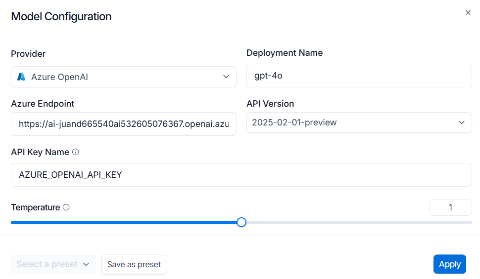

Paso 16. Haz clic en el ícono de la llave al costado de **Save**, ubicado en el costado superior derecho. Esto abrirá una ventana que solicita la API Key. Usa la misma del primer ejercicio del laboratorio anterior. 

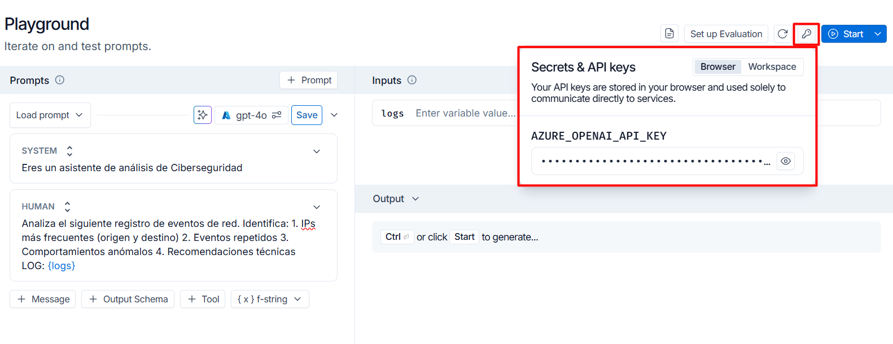

Paso 17. Al costado izquierdo de ese ícono de la llave, haz clic en **Set up Evaluation**.

Paso 18. En **Select a datset** en la pestaña inferior selecciona: **Security Logs 1 example**. En output de la sección **Reference Outputs** agrega ```{logs}```.

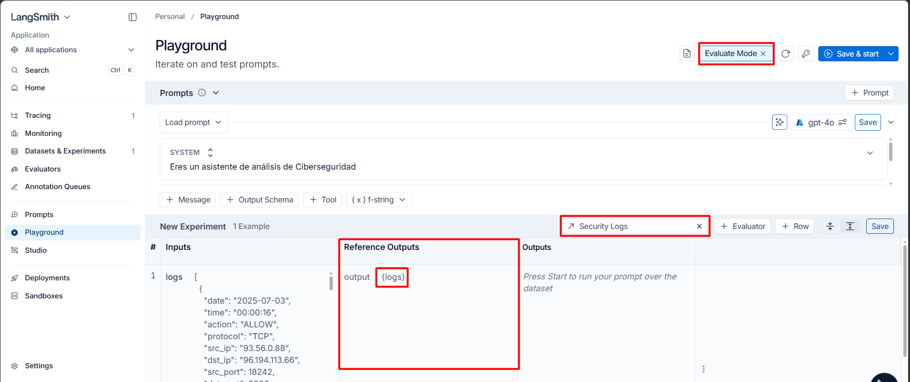

Paso 19. Haz clic en **Save & start**.

### Resultado esperado

Échale un vistazo al resultado en la sección Outputs. 

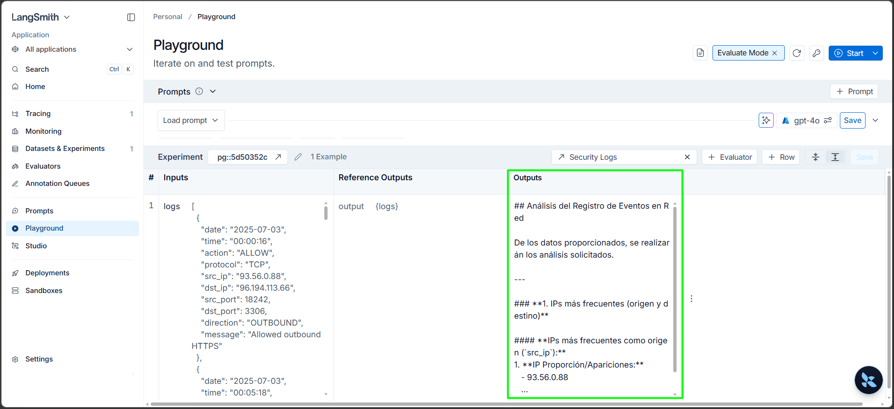

En el menú del costado izquierdo selecciona nuevamente **Datasets & Experiments**, valida las métricas de ejecución del modelo. 

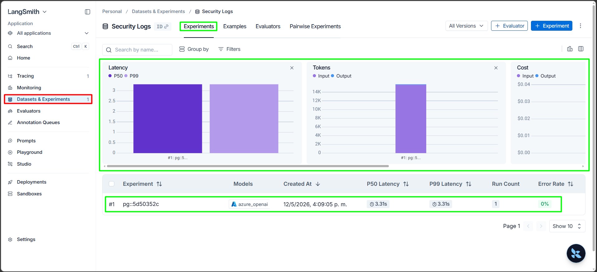