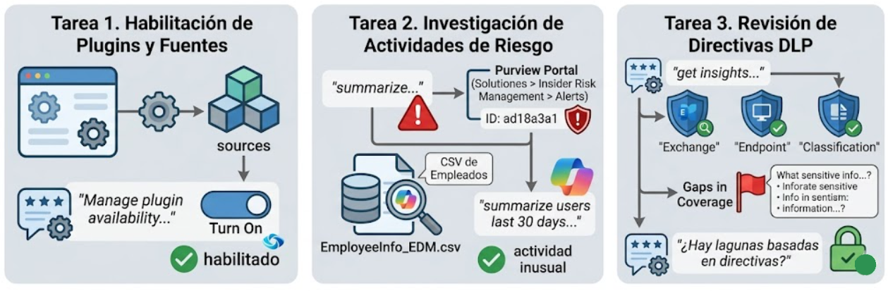
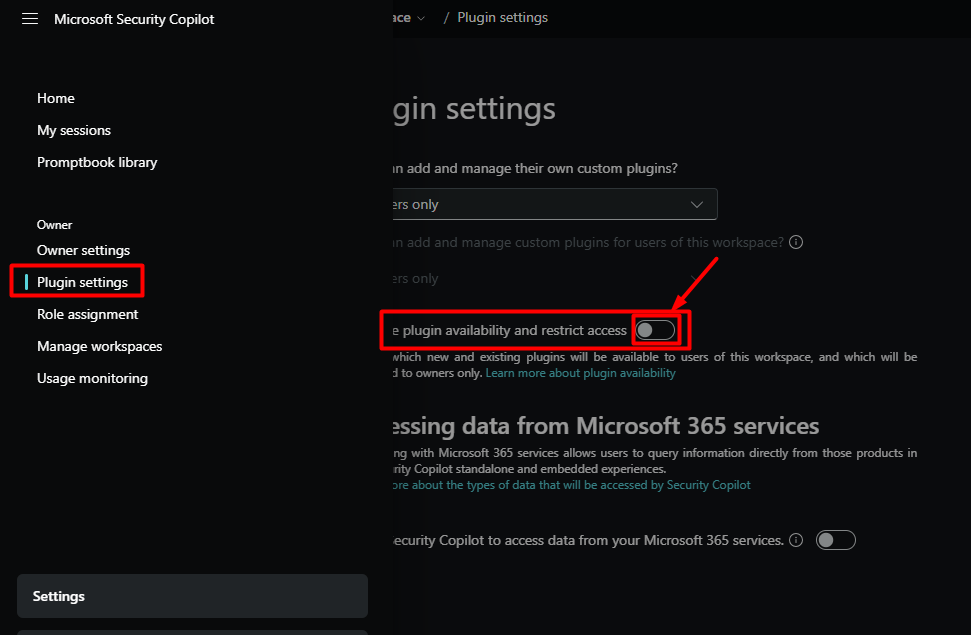
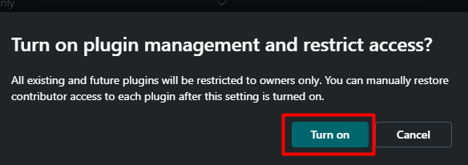
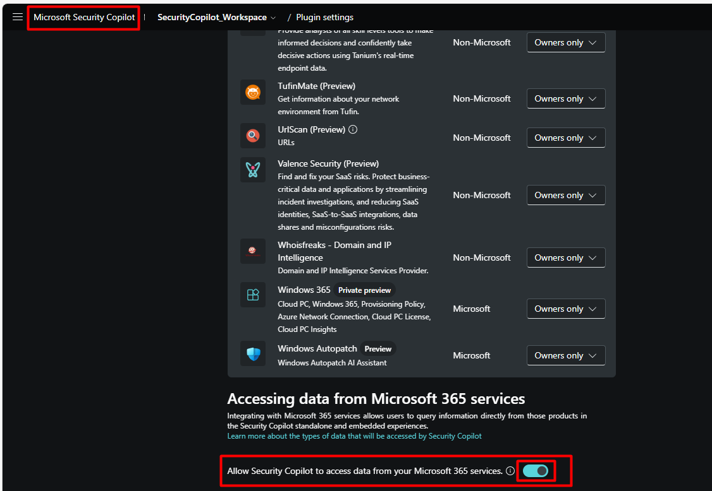
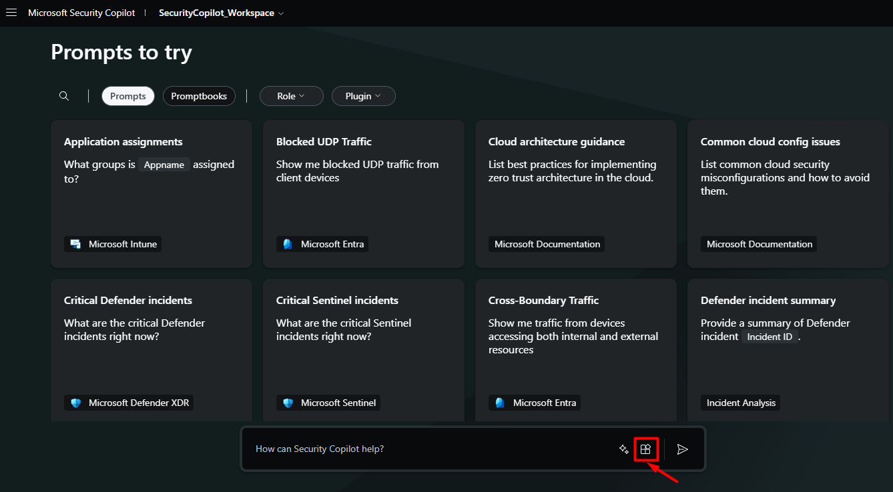
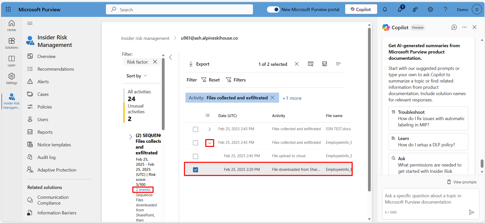
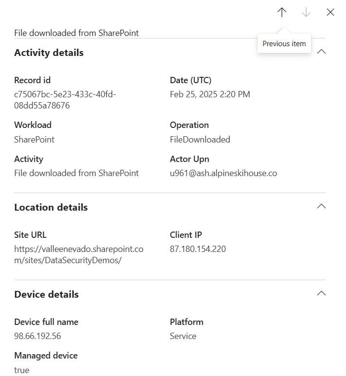
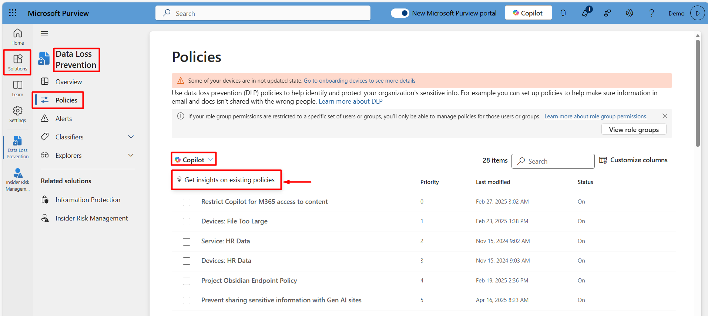
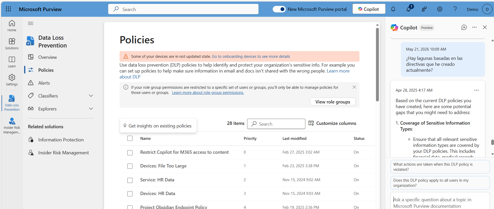

# Explora las capacidades de Copilot en Microsoft Purview

## Objetivo de la práctica:
Al finalizar la práctica, serás capaz de:

- **Identificar** las principales funcionalidades de Copilot integradas en Microsoft Purview.
- **Aplicar** comandos o escenarios básicos para interactuar con Copilot dentro de la plataforma.
- **Analizar** los resultados generados por Copilot para apoyar la toma de decisiones en seguridad y cumplimiento.

## Objetivo Visual 




## Instrucciones 

>📌 **Nota**: Por actualizaciones en la plataforma de Microsoft, este ejercicio debe realizarse a través de estos dos links: Link1, link2. Puede que la siguiente guía contenga diferencias.
Link1:[Interactive guide: Investigate sensitive activity in Activity explorer](https://microsoftlearning.github.io/click-throughs/docs/IG/interactive_guide_investigate_sensitive_activity_in_activity_explorer_web/story.html)
Link2:[Interactive guide: Investigate a DLP alert with Security Copilot](https://microsoftlearning.github.io/click-throughs/docs/IG/interactive_guide_investigate_a_dlp_alert_with_security_copilot_web/story.html)


Copilot en Microsoft Purview puede apoyar a las áreas de ciberseguridad al facilitar el análisis de grandes volúmenes de datos relacionados con riesgos, cumplimiento y protección de la información. Permite identificar patrones, generar recomendaciones y automatizar tareas como la clasificación de datos, la detección de posibles incidentes y la interpretación de alertas, ayudando a los equipos a tomar decisiones más rápidas y fundamentadas, así como a fortalecer la postura de seguridad de la organización.

En este ejercicio, asumirás el rol de un analista de ciberseguridad que necesita comprender cómo Copilot en Microsoft Purview puede apoyar la identificación y análisis de riesgos de información dentro de una organización. A partir de un conjunto de datos o escenarios propuestos, interactuarás con Copilot para obtener información relevante, interpretar los resultados generados y evaluar cómo estos pueden contribuir a mejorar la toma de decisiones en materia de seguridad y cumplimiento.


>📌 **Nota**: El siguiente laboratorio fue desarrollado por Microsoft y se encuentra en el Microsoft Learn. 

>📌 **Nota**: El entorno de este ejercicio es una simulación generada a partir del producto. Al ser una simulación limitada, es posible que los vínculos de alguna página no estén habilitados y que no se admiten las entradas de texto que se encuentren fuera del script especificado. Aparece un mensaje emergente que indica que "Esta característica no está disponible en la simulación". Cuando esto ocurra, seleccione Aceptar y continúe con los pasos del ejercicio.

### Tarea 1. Habilitar el complemento de Microsoft Purview
Paso 1. Para abrir el entorno simulado, selecciona este vínculo: [Microsoft Security Copilot](https://app.highlights.guide/start/6fca2b1c-bf14-4c26-9eda-48be3c0b5013?token=045faae1-1078-4eac-bf56-e12472eddaf9&link=1)

Paso 2. En la ventana de Security Copilot haz clic en el menú principal, identificado por el ícono de las rayas horizontales ubicadas en la esquina superior izquierda. 

Paso 3. Selecciona la opción **Plugin settings** y luego habilita **Manage plugin availability and restrict access**.



Paso 4. Haz clic en **Turn on** en la ventana de confirmación que aparece. 



Paso 5. Baja hasta el final del listado y activa la opción **Allow Security Copilot to access data from your Microsoft 365 services**.

Paso 6. Regresa a la página principal de Security Copilot haciendo clic en el título **Microsoft Security Copilot** de la esquina superior izquierda. 



Paso 7. Luego, haz clic en el ícono de los cubos apilados de la barra de prompt denominado **sources**.



Paso 8. En la nueva ventana selecciona **Mostrar 13 más**. Desplázate hacia abajo hasta encontrar el complemento de Microsoft Purview y activa la casilla junto a él. Luego cierra la ventana de complementos. 

### Tarea 2. Investigar la actividad de riesgo mediante Security Copilot

En esta tarea debes revisar una alerta de posible fuga de información. Para ello, primero analiza los indicios de riesgo y luego apóyate en Security Copilot para agilizar la investigación, centrándote en la actividad del archivo **EmployeeInfo_EDM.csv**, que contiene datos sensibles de empleados.

Paso 1. Accede a [Microsoft Purview Portal](https://app.highlights.guide/start/6fca2b1c-bf14-4c26-9eda-48be3c0b5013?token=045faae1-1078-4eac-bf56-e12472eddaf9)

Paso 2. En el portal de Microsoft Purview, ingresa a: **Soluciones** > **Insider Risk Management** > **Alerts**.

Paso 3. Seleccione la primera alerta de la lista con el identificador de alerta ad18a3a1.

Paso 4. Revisa la alerta:  
- Comprueba el nombre de la alerta, la directiva asociada, la gravedad y la puntuación de riesgo. Verifica cuándo se activó y cuál fue la causa.  
- Selecciona **View all derails** para consultar el perfil del usuario, incluida su pertenencia a grupos y el estado de prioridad. Cierra el panel. 
- En la pestaña **All risk factors for this user's activity**, examina la actividad de filtración, la actividad de secuencia, el contenido de prioridad y los tipos de información sensible.  
- Ve a la pestaña **Explorador de actividades** y revisa los eventos clave alrededor de la fecha de la alerta. **Nota**: De ser necesario disminuye el zoom del navegador.  
- Usa la pestaña **User Activity** para analizar patrones de comportamiento en un intervalo de tiempo más amplio.  

Paso 5. Usa Security Copilot para guiar una revisión más profunda:  
- En la página de alertas, selecciona **Summarize** para generar un resumen rápido de la alerta y del comportamiento reciente del usuario.  
- En el panel de Copilot, elige el mensaje predefinido **Summarize user's last 30 days of activuty**.  
- Cuando se cargue el resumen, revisa la respuesta y luego selecciona **View all activity** para abrir la vista completa de actividad del usuario.  
- En el panel izquierdo, selecciona **Unusual Activities**.  
- En la primera actividad de secuencia listada para el **25 de febrero de 2025** haz clic en el vínculo **2 eventos** para ver las acciones incluidas en esa secuencia.  
- Localiza la entrada **EmployeeInfo_EDM.csv**, expande los detalles y revisa las acciones asociadas a este archivo.  





### Tarea 3. Revisión de la información de directivas de prevención de pérdida de datos mediante Security Copilot

En esta tarea vas a usar Security Copilot para detectar fortalezas y vacíos en la cobertura de las políticas DLP. En organizaciones grandes puede ser complicado saber rápido si las reglas protegen bien todos los datos y ubicaciones, pero Copilot te muestra la información clave y te ayuda a enfocarte en lo que realmente importa.

Paso 1. En el portal de Microsoft Purview, ve a **Soluciones** > **Data Loss Prevention** > **Policies**.

Paso 2. En el botón de Copilot sobre el listado de políticas selecciona **Get insights on existings policies**.



Paso 3. Explora cada categoría de perspectivas.

Paso 4. Selecciona **Insights by location** (Conclusiones por ubicación) y, a continuación, elije **Exchange**. Revisa la información que se muestra.

Paso 5. Repite este proceso para **Endpoint**.

Paso 6. Selecciona **Insights by Administrative units** (Conclusiones por unidades administrativas) y revisa los resultados.

Paso 7. Selecciona **Insights by Classification of data** (Información por clasificación de datos ) y revisa los resultados.

Paso 8. En la parte inferior del panel Copilot, seleccione el mensaje predefinido **What types of sensitive information are we protecting with these DLP policies?** y revisa los resultados.

Paso 9. En el panel Copilot, seleccione el mensaje predefinido **Does this DLP policy apply to all users in my organization?** y revisa los resultados.

Paso 10. Finalmente, escribe el siguiente prompt: ```¿Hay lagunas basadas en las directivas que he creado actualmente?``` y revisa la respuesta proporcionada. 


